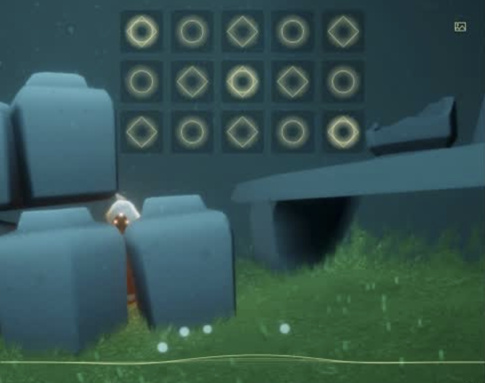

# iCreate-GuitarSimulator
iCreate-让创作贴近生活：模拟吉他版本（基于Coffee）【icreate - making creation close to life: simulated guitar version (based on coffee)】

有趣的乐器模拟器，推荐使用Edge体验！

+ [演示视频](https://www.bilibili.com/video/BV1HC4y1x7ek/)
+ [体验入口](https://blog.creativecc.cn/iCreate-GuitarSimulator/index)

### 主页
主页Index由LOGO，导航，交互式指板（包括主题切换，类型切换和主调切换），制表编辑器，模拟架子鼓（Release Pressure-DrumKit）入口，打击垫入口（Enjoy Life-SkyPiano）和吉他调音器入口（Online-GuitarTuner）组成。

### 模拟架子鼓
按住键盘Q,W,E,A,S,D,Z,X,C实现敲击，不支持鼠标点击！

### 打击垫钢琴
鼠标直接点击垫片～

### 在线调音器
需要麦克风权限

### 垫片播放器
键入乐谱实现自动播放

#### 说明
2020计算机设计大赛国赛三等奖

© JackHCC
169
